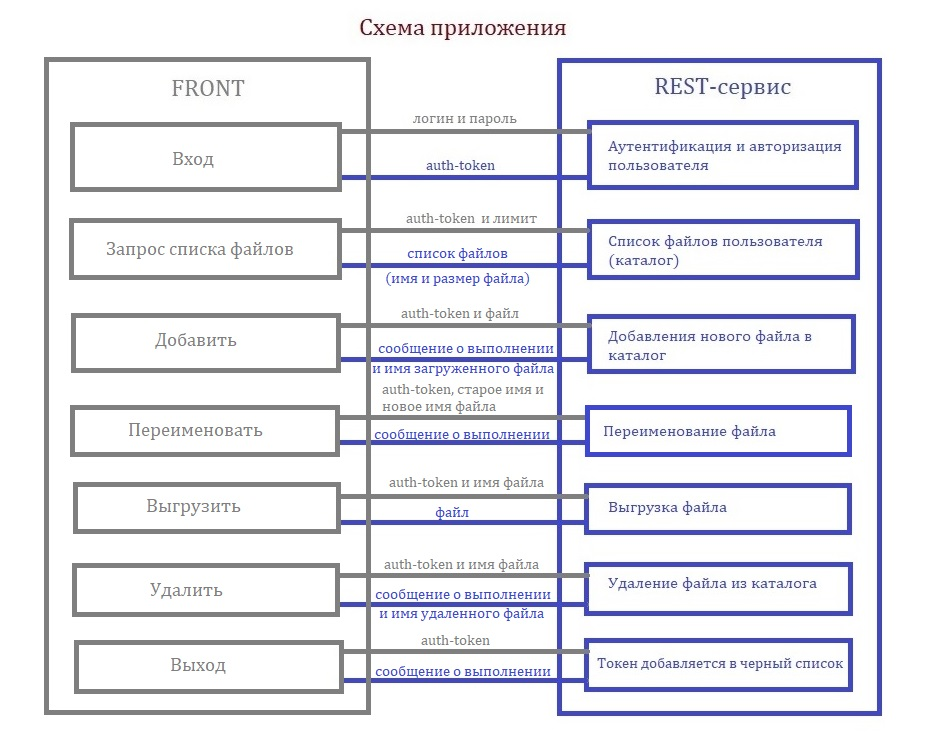
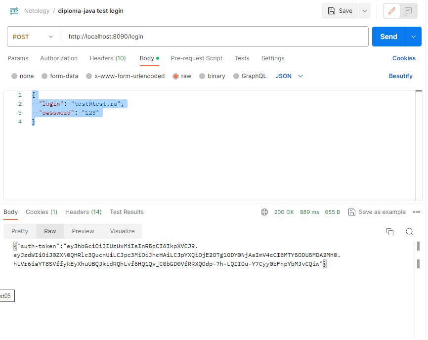
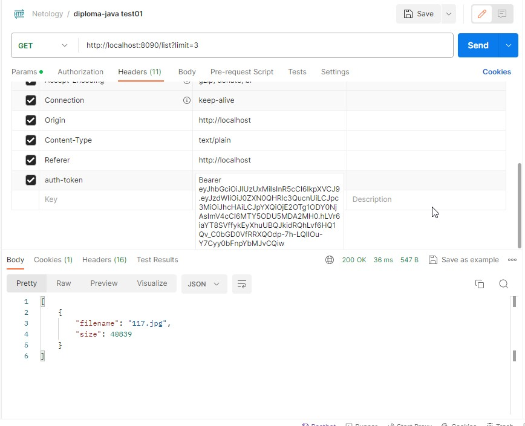
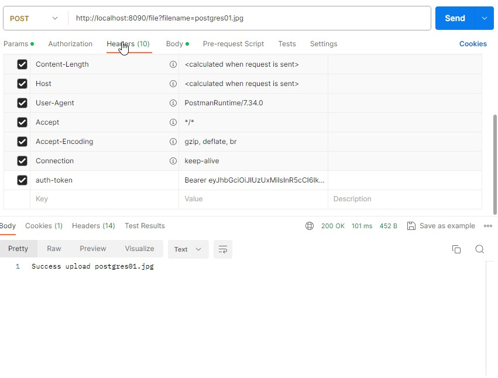
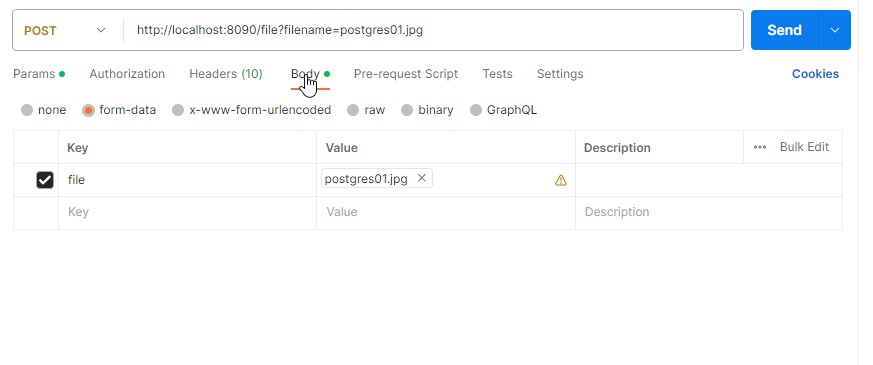
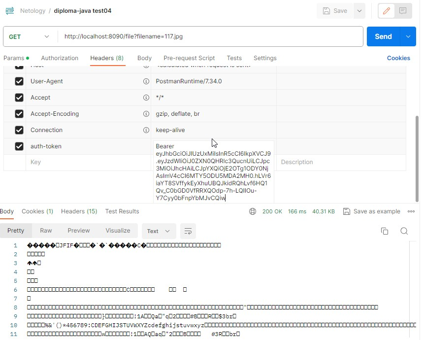
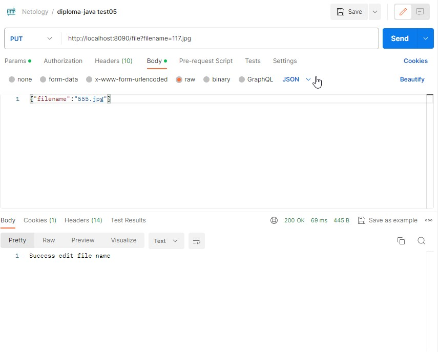
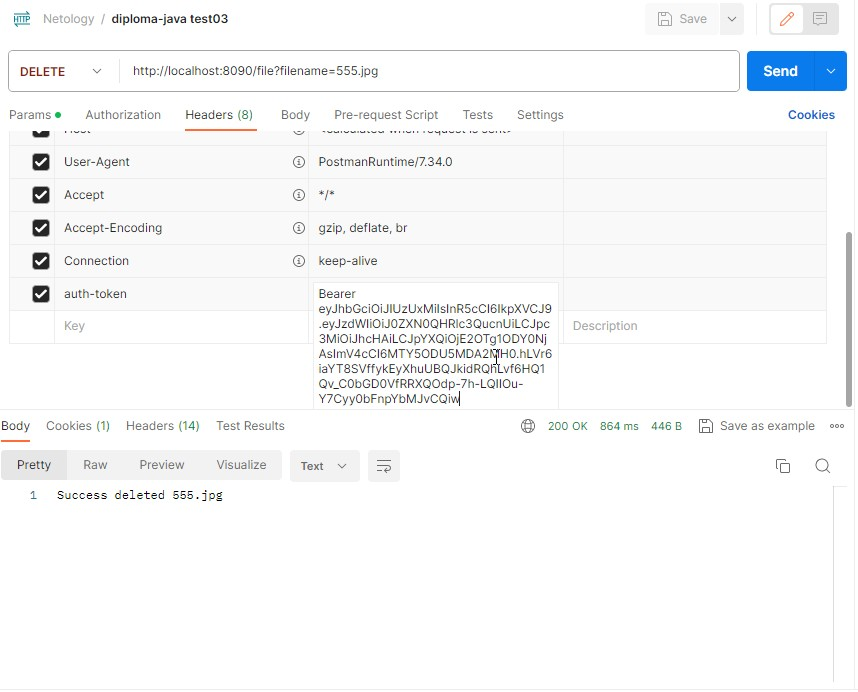
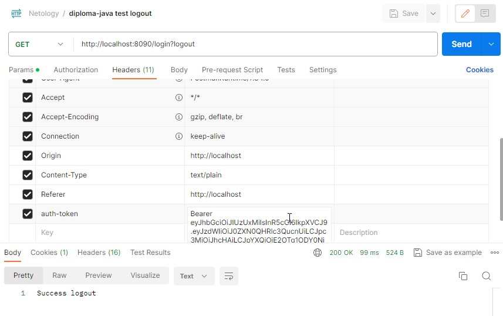

## Дипломная работа

# "Облачное хранилище"

### Выполнила Лариса Черная

*Описание* 

Разработан REST-сервис, предоставляющий интерфейс для загрузки файлов и вывода списка уже загруженных файлов пользователя. [по заданой спецификации](https://github.com/netology-code/jd-homeworks/blob/master/diploma/CloudServiceSpecification.yaml).

Разработанный сервис взаимодействует с созданным сторонним разработчиком веб-приложением (FRONT) для использования его пользовательского интерфейса для авторизации, загрузки и вывода списка файлов пользователя. Все запросы к сервису проверяются на авторизацию.

Информация о пользователях сервиса (логины для авторизации) храняться в базе данных. Файлы пользователя хранятся в каталогах файловой системы.

Сервис написан на языке Java с использоватем фреймворка Spring Boot. Для хранения данных используется сервер баз денных Postgres.

Использован сборщик пакетов gradle.

*Функционал приложения "Облачное хранилище"*

- Сервис предоставляет REST-интерфейс для интеграции с FRONT.
- Сервис реализует все методы, описанные [в спецификации](https://github.com/netology-code/jd-homeworks/blob/master/diploma/CloudServiceSpecification.yaml):
   - Вывод списка файлов.
   - Добавление файла.
   - Переименование файла.
   - Скачивание файла.
   - Удаление файла.
   - Авторизация.

  

*Архитектура приложения*

Приложение состоит из двух основных компонентов:
 - Сторона клиента (пользовательский интерфейс).
 - Серверная часть (бэкэнд) отвечает на HTTP-запросы, управляет бизнес-логикой и предоставляет доступ к данным. 

*Форматы данных*

Данные пользователей необходимые для аутентификации хранятся в базе данных. Логин имеет формат адреса электронной почты (проверка на соответствие формату проводится на FRONT при идентификации пользователя). Пароль не хранится в открытом виде, в базе данных хранится хэш пароля. Для авторазации пользователей необходима роль. Роль хранится в таблице с логином и паролем. Так как не было требований к допуску к тем или иным действиям в зависимости от роли, то используется только одна роль USER.

Файлы пользователя хранятся в каталоге операционной системы. Основой каталог имеет имя совпадающее с логином пользователя. Удаленные файлы не удаляются физически, а переносятся в каталог DELETED.

*Настройки приложения*

Настройки приложения хранятся в файле application.properties в корне проекта.
Основной настройки:
 - номер порта, с которым работает REST-сервис;
 - параметры доступа к базе данных;
 - секретный код, используемый для генерации токена;
 - настройки облочного хранилища:
   - путь к каталогу с каталогами и файлами пользователей, например, cloud-storage-directory = c:\cloud\ 
   - ссылка на адрес по которому запущен FRONT, например, cloud-front-url = http://localhost:8080

*Запуск приложения в докере*

В корне проекта находится подготовленный Dockerfile и docker-compose.yaml 

Из корневой папки проекта нужно открыть терминал и выполнить команду:

   ### docker-compose up -d 

После этого нужно запустить в браузере  приложение FRONT по ссылке http://localhost:8080/ или приложение Postman и выполнить тестирование.

*Тестирование*

Все разработанные методы REST-сервиса покрыты юнит-тестами с использованием mockito.

Были разработаны тесты использующие тестконтейнер.

Также было выполнено тестирование с помощью Postman:
1) запрос на аутентификацию
   
POST http://localhost:8090/login
{
  "login": "test@test.ru",
  "password": "123"
}

1) запрос списка файлов пользователя
   
GET http://localhost:8090/list?limit=3
добавить в список Headers auth-token и в него скопировать полученный на предыдущем запросе ответ

1) добавление файла в каталог пользователя
   
POST http://localhost:8090/file?filename=postgres01.jpg
добавить в список Headers auth-token и в него скопировать полученный на первом шаге ответ
   
в Body указать файл для загрузки

1) скачивание файла
   
GET http://localhost:8090/file?filename=117.jpg
добавить в список Headers auth-token и в него скопировать полученный на первом шаге ответ

1) переименование файла
   
PUT http://localhost:8090/file?filename=117.jpg
{"filename":"555.jpg"}
добавить в список Headers auth-token и в него скопировать полученный на первом шаге ответ

1) удаление файла
   
DELETE http://localhost:8090/file?filename=555.jpg
добавить в список Headers auth-token и в него скопировать полученный на первом шаге ответ

1) выход
      
GET http://localhost:8090/login?logout
добавить в список Headers auth-token и в него скопировать полученный на первом шаге ответ

